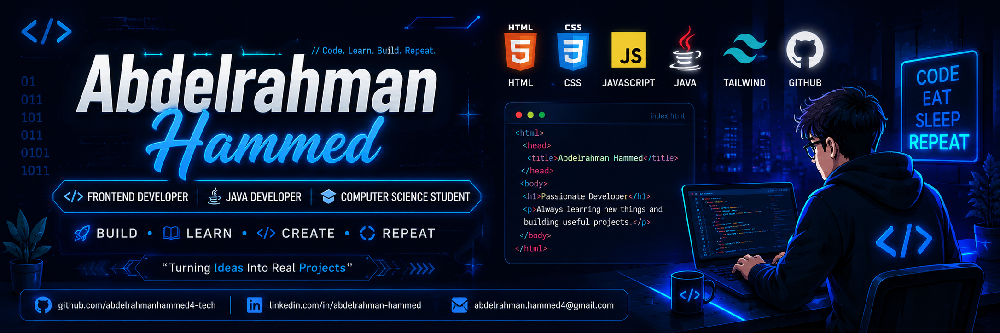

<!-- ========================= -->
<!--       HERO SECTION        -->
<!-- ========================= -->

<p align="center">
  
</p>

<h1 align="center">
Hi 👋 I'm Abdelrahman Hammed
</h1>

<h3 align="center">
Frontend Developer • Java Developer • Computer Science Student
</h3>

<p align="center">

</p>

<p align="center">

<a href="https://github.com/abdelrahmanhammed4-tech">

</a>

<a href="https://www.linkedin.com/in/abdelrahman-hammed-9b8a793a3/">

</a>

<a href="mailto:abdelrahmanhammed4@gmail.com">

</a>

</p>

<p align="center">
<a href="https://abdelrahmanhammed4-tech.github.io/Abdelrahman/">

</a>

</p>


---

# 💫 About Me

```yaml
Name: Abdelrahman Hammed

Location: Egypt 🇪🇬

University:
Al-Azhar University

Degree:
Computer Science Student

Current Focus:
Frontend Development

Learning:
JavaScript
Java
SQL
Backend Development

Goal:
Become a Professional Full Stack Developer

Portfolio:
https://abdelrahmanhammed4-tech.github.io/Abdelrahman/
```

---

# 🚀 Current Focus

- 🌱 Learning JavaScript
- ☕ Improving Java OOP
- 💻 Building Responsive Websites
- 📚 Studying Database Design
- ⚡ Working on Real Projects
- 🎯 Preparing for Full Stack Development

---

# 🛠 Tech Stack

## 🌐 Frontend

<p align="center">


</p>

## 💻 Programming Languages

<p align="center">


</p>

## 🗄 Database

<p align="center">


</p>

## ⚙ Tools

<p align="center">


</p>

---

# 📖 Learning Progress

HTML          ██████████ 100%

CSS           ██████████ 100%

Tailwind      ██████████ 100%

JavaScript    ███████░░░ 70%

Java          ████████░░ 80%

SQL           █████░░░░░ 50%

Backend       ██░░░░░░░░ 20%

---
> 💙 **"Code. Learn. Build. Repeat."**
<!-- ====================================== -->
<!--         GitHub Analytics               -->
<!-- ====================================== -->

# 📊 GitHub Analytics

<div align="center">


</div>

<br>

<div align="center">


</div>

---

# 📈 Contribution Graph

<p align="center">


</p>

---

# 🏆 GitHub Trophies

<p align="center">


</p>

---
# 🚀 Coding Journey

```text
2026 Roadmap

✅ HTML

✅ CSS

✅ Tailwind CSS

🔄 JavaScript

🔄 Java

🔄 SQL

⏳ React

⏳ Backend

⏳ Spring Boot

🎯 Full Stack Developer
```

<div align="center">

### 🚀 *Building clean code, solving problems, and learning every day.*

</div>

<!-- ====================================== -->
<!--        Featured Projects               -->
<!-- ====================================== -->

# 🚀 Featured Projects

<table>
<tr>

<td width="50%" valign="top">

### 🌐 Personal Portfolio

🔗 Live Demo:
https://abdelrahmanhammed4-tech.github.io/Abdelrahman/

📂 GitHub:
Coming Soon

⚙️ HTML • CSS • JavaScript
</td>

<td width="50%" valign="top">

## 🎓 Student Dashboard

📚 Dashboard UI

🔐 Login System

📱 Responsive Design

💻 GitHub Repository

🔗 Coming Soon

</td>

</tr>

<tr>

<td width="50%" valign="top">

## 📚 Educational Platform

🌍 Multi-language

🗄 Database Ready

👨‍🎓 Student Dashboard

💻 GitHub Repository

🔗 Coming Soon

</td>

<td width="50%" valign="top">

## ☕ Java OOP Projects

💻 Java OOP

🧩 Design Patterns

📦 Console Applications

💻 GitHub Repository

🔗 Coming Soon

</td>

</tr>

<tr>

<td width="50%" valign="top">

## 🏥 Hospital Management

📋 Appointment System

👨‍⚕ Doctor Dashboard

🗄 Database Ready

💻 GitHub Repository

🔗 Coming Soon

</td>

<td width="50%" valign="top">

## ✅ Task Management App

📱 Clean UI

📝 Tasks

📅 Productivity

💻 GitHub Repository

🔗 Coming Soon

</td>

</tr>

</table>

---

# 📜 Certifications

🏅 HTML & CSS

🏅 Responsive Web Design

🏅 Tailwind CSS

🏅 Java OOP

🏅 SQL Fundamentals

🏅 AI Fundamentals

🏅 Git & GitHub

---

# 🎯 2026 Goals

✅ Build 20+ Professional Projects

✅ Master JavaScript

✅ Learn React

✅ Learn Node.js

✅ Master SQL

✅ Learn Spring Boot

✅ Become Full Stack Developer

✅ Reach 1000+ GitHub Contributions

---

# 📚 Currently Learning

```text
Frontend          ██████████ 100%

Tailwind CSS      ██████████ 100%

JavaScript        ███████░░░ 70%

Java               ████████░░ 80%

SQL                █████░░░░░ 50%

Backend            ██░░░░░░░░ 20%

React              ░░░░░░░░░░ 0%

Spring Boot        ░░░░░░░░░░ 0%
```

---

# 🏅 Achievements

🥇 Frontend Developer

🥈 Java Developer

🥉 Problem Solver

🌱 Lifelong Learner

💡 Creative Thinker

🚀 Future Full Stack Engineer

---

# 💬 Favorite Quote

> **"Success doesn't come from what you do occasionally. It comes from what you do consistently."**
 <!-- ====================================== -->
<!--        Connect With Me                 -->
<!-- ====================================== -->

# 📫 Connect With Me

<p align="center">

<a href="https://www.linkedin.com/in/abdelrahman-hammed-9b8a793a3/">

</a>

<a href="mailto:abdelrahmanhammed4@gmail.com">

</a>

<a href="https://abdelrahmanhammed4-tech.github.io/Abdelrahman/">

</a>

<a href="https://github.com/abdelrahmanhammed4-tech">

</a>

</p>

---

# 📈 Visitor Count

<p align="center">


</p>

---

# 💬 Random Dev Quote

<p align="center">


</p>

---

# 🐍 Contribution Snake

<p align="center">


</p>

---

# ☕ Support My Work

If you enjoy my projects, don't forget to ⭐ my repositories.

---

# 🎯 Motto

> **"Code. Learn. Build. Repeat."**

---

<div align="center">

## 🚀 Thanks for Visiting My Profile

### Keep Learning • Keep Building • Keep Growing


</div>
